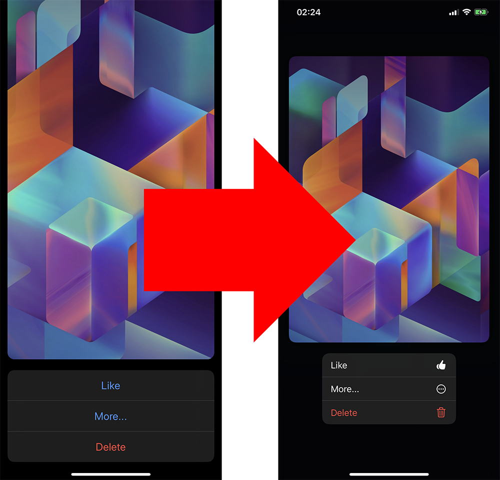

# LNPreviewToContextMenu



`LNPreviewToContextMenu` is a framework for automatically transforming your existing 3D Touch Peek&Pop preview controllers and actions into the new `UIContextMenu` system in iOS 13.

[](https://github.com/LeoNatan/LNPreviewToContextMenu/releases) [](https://github.com/LeoNatan/LNPreviewToContextMenu/stargazers) [](https://raw.githubusercontent.com/LeoNatan/LNPreviewToContextMenu/master/LICENSE) <span class="badge-paypal"><a href="https://www.paypal.com/cgi-bin/webscr?cmd=_s-xclick&hosted_button_id=BR68NJEJXGWL6" title="Donate to this project using PayPal"></a></span>

[](https://github.com/LeoNatan/LNPreviewToContextMenu/issues) [](https://github.com/LeoNatan/LNPreviewToContextMenu/graphs/contributors) [](https://github.com/Carthage/Carthage)

With this framework, your existing 3D Touch Peek&Pop previewing code will automagically display in the new `UIContextMenu` system under iOS 13 and above.

### Features

- [x] Supports storyboard and code-based previewing
- [x] Optionally, supports adding images to your existing preview action items to display as menu item images
- [x] Adds support for devices without 3D Touch (including iPhone 11 and iPads)
- [x] Mac Catalyst support (your preview actions are displayed as context menus)

## Adding to Your Project

### Swift Package Manager

Swift Package Manager is the recommended way to integrate `LNPreviewToContextMenu` in your project.

`LNPreviewToContextMenu` supports SPM versions 5.1.0 and above. To use SPM, you should use Xcode 11 to open your project. Click `File` -> `Swift Packages` -> `Add Package Dependency`, enter `https://github.com/LeoNatan/LNPreviewToContextMenu`. Select the version you’d like to use.

You can also manually add the package to your `Package.swift` file:

```swift
.package(url: "https://github.com/LeoNatan/LNPreviewToContextMenu.git", from: "1.0")
```

And the dependency in your target:

```swift
.target(name: "BestExampleApp", dependencies: ["LNPreviewToContextMenu"]),
```

### Carthage

Add the following to your Cartfile:

```github "LeoNatan/LNPreviewToContextMenu"```

Make sure you follow the Carthage integration instructions [here](https://github.com/Carthage/Carthage#if-youre-building-for-ios-tvos-or-watchos).

### Manual

Drag the `LNPreviewToContextMenu.xcodeproj` project to your project, and add `LNPreviewToContextMenu.framework` to **Frameworks, Libraries, and Embedded Content** in your project target's **General** tab. Xcode should sort everything else on its own.

Check out the included example project to see how it is integrated with the framework.

### CocoaPods

CocoaPods is not supported. There are many reasons for this. Instead of CocoaPods, use Swift Package Manager. You can continue using CocoaPods for for your other dependencies and Swift Package Manager for `LNPreviewToContextMenu`.

## Using the Framework

Just link your project with the framework, and the magic will happen automatically. 

Optionally, import `<LNPreviewToContextMenu/UIPreviewAction+Images.h>` to add support for images to your preview action items.
